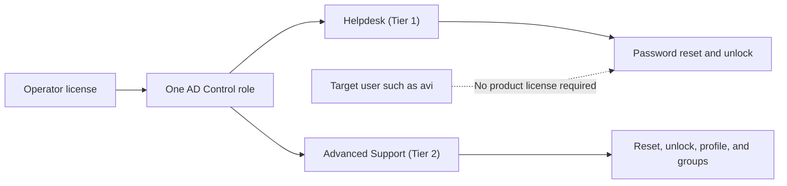

# Access Model, Licensing, and RBAC

AD Control separates product access from target-user management.

Operators need a product license and one AD Control role. The users they manage do not need a license.

## Access Layers

| Layer | What it controls |
|---|---|
| Product license | Whether the operator consumes an AD Control seat. |
| Role assignment | What the operator can do in the portal. |
| Settings access | Who can manage AD Control configuration. |
| Protection rules | Which users and groups are blocked from routine support workflows. |

## Operator Examples

- david has a license and the Helpdesk (Tier 1) role.
- sara has a license and the Advanced Support (Tier 2) role.
- avi does not need a license because avi is only the managed target user.
- jim has settings access and can manage protected users, protected groups, roles, and policy.

## Built-In Role Behavior

| Role | Typical capabilities |
|---|---|
| Helpdesk (Tier 1) | Password reset and account unlock for standard users. |
| Advanced Support (Tier 2) | Tier 1 actions plus profile updates and controlled group management. |
| Settings administrator | License assignment, RBAC, protected identities, OTP, SMTP, and session policy. |

## Tier Options

When assigning a user, the administrator chooses one role:

- **Helpdesk (Tier 1)** for routine support operators.
- **Advanced Support (Tier 2)** for operators who also need profile updates and controlled group management.

A user should have one active AD Control role at a time. Change the role from Settings when moving an operator between tiers.

## Operational Rule

Assign the operator license and role deliberately. Do not license target users just because they are being managed through AD Control.
