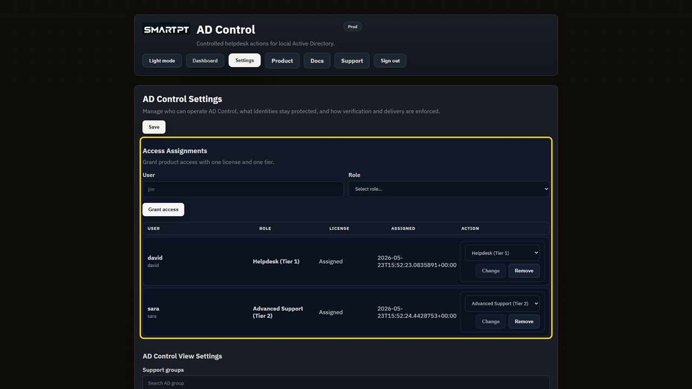
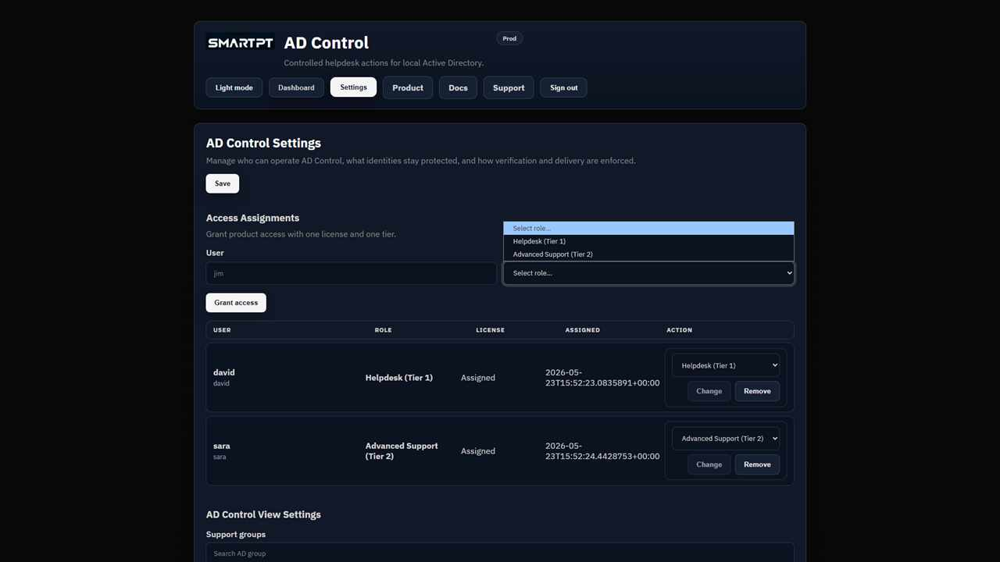

# AD Control licensing and RBAC

AD Control assigns licenses and product roles to operators. Target users do not require a product license.

## Access layers

| Layer | What it controls |
| --- | --- |
| Product license | Allows an operator to use AD Control and consumes an operator seat. |
| Operator role | Defines Tier 1 or Tier 2 actions. |
| Settings access | Allows product configuration and license administration. |
| Protection rules | Excludes Tier 0, protected users, and protected group members from operator workflows. |

## Operator roles

| Role | Available actions |
| --- | --- |
| **Helpdesk (Tier 1)** | Password reset and account unlock for standard users. Cannot change phone numbers, edit profile attributes, or manage groups. |
| **Advanced Support (Tier 2)** | Tier 1 actions plus approved profile updates and controlled group membership. |

Assign one active AD Control role to each operator.

## Assign operator access

1. Open **Settings > Access Assignments**.
2. Select the Active Directory user.
3. Assign an AD Control product license.
4. Select **Helpdesk (Tier 1)** or **Advanced Support (Tier 2)**.
5. Save the assignment.

## Expected result

The operator can enter AD Control and sees only the actions allowed by the assigned role. Standard target users remain manageable without consuming licenses.

## Verify access

Sign in as each operator role and compare the available actions. Confirm **Settings** is visible only to settings administrators.
