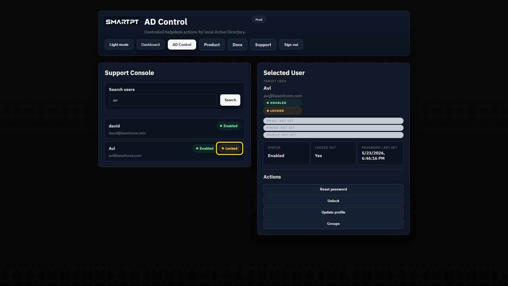
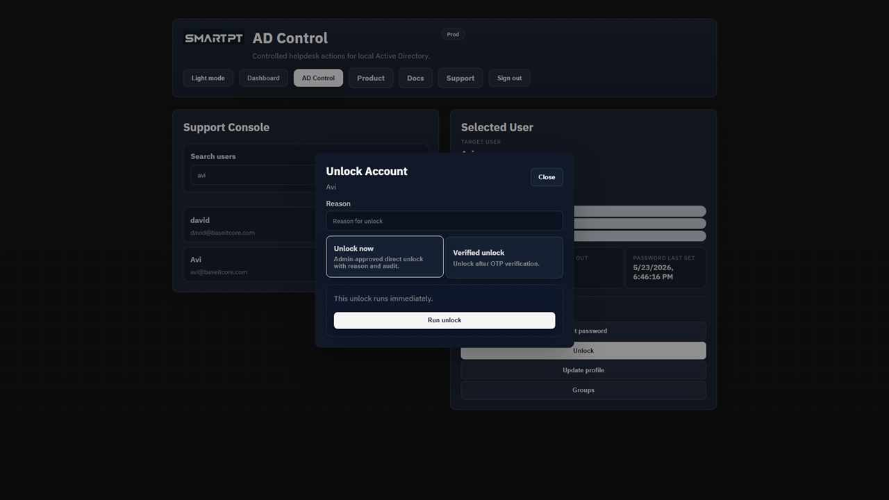
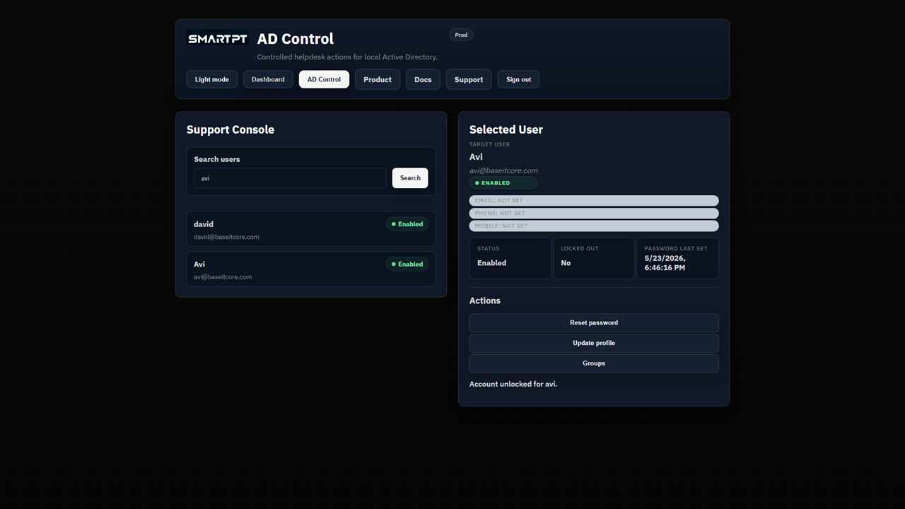

# Unlock an Active Directory account

Use direct or OTP-verified unlock for a locked standard user when the selected method is enabled in Settings.

## Before you begin

- The operator needs an AD Control license and an allowed Tier 1 or Tier 2 role.
- The target user must be locked, standard, and not protected.
- OTP-verified unlock requires a configured delivery channel and Active Directory contact value.

## Direct unlock

1. Search for and select the locked user.
2. Click the direct unlock action.
3. Enter the required reason.
4. Confirm the unlock.

## OTP-verified unlock

1. Search for and select the locked user.
2. Choose the verified unlock option.
3. Select the delivery channel and send OTP.
4. Enter the code provided by the user.
5. Confirm the unlock.

## Expected result

The account lock is cleared and the operator console shows the updated state.

## Verify the unlock

Refresh the selected user, confirm the locked state is cleared, and review the unlock audit record.

The unlock action appears only when the account is locked and the operator has permission.
