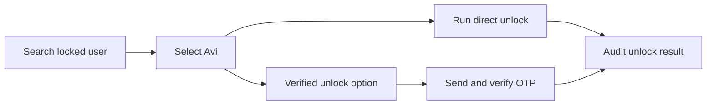

# Account Unlock Workflows

AD Control supports direct unlock and verified unlock for locked Active Directory users.

The unlock button appears when the selected user is locked and the operator has account unlock permission.

## Direct Unlock

Direct unlock runs immediately when enabled by policy. The operator should provide an operational reason when required.

## Verified Unlock

Verified unlock requires OTP before the unlock action completes.

The flow is:

1. Search and select the locked user.
2. Choose Unlock.
3. Select the verification channel.
4. Send OTP.
5. Enter the OTP provided by the user.
6. Verify and unlock.

## Policy Control

Administrators can enable or disable direct unlock and verified unlock from Settings. At least one unlock method should remain available for operational continuity.
