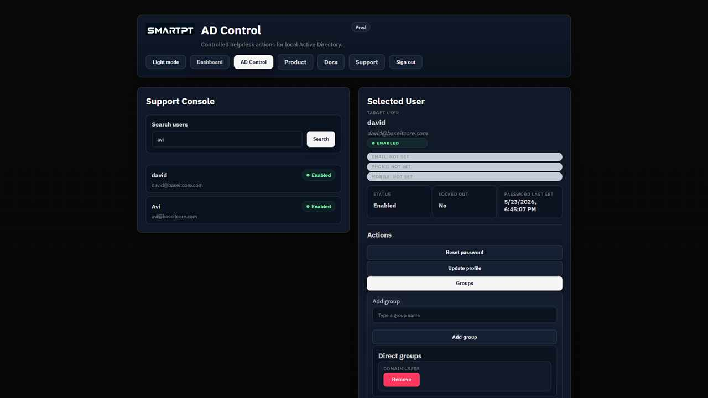

# Controlled Group Management

Advanced Support (Tier 2) operators can manage approved group membership for standard users.

## What Operators See

The group panel separates:

- direct groups
- nested/effective groups
- available add/remove actions

## Allowed Group Boundary

Administrators control which groups can be added or removed. Protected groups and privileged groups should not be available for routine Tier 2 operations.

## Recommended Practice

- Keep the allowed group list narrow.
- Do not include Tier 0 or privileged groups.
- Test add/remove behavior with a non-production group first.
- Review audit records after group changes.

