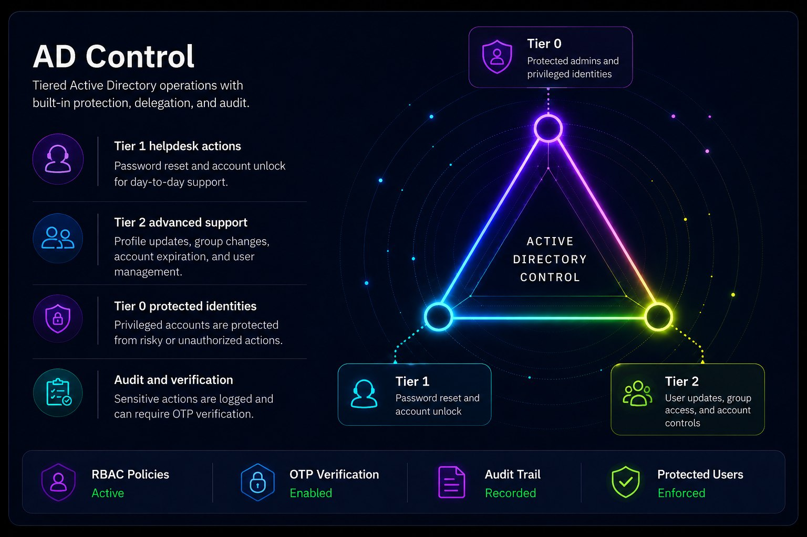

# Get started with AD Control

AD Control lets authorized operators reset passwords, unlock accounts, update approved attributes, and manage permitted group memberships without direct Active Directory permissions for those actions.

## Access model

| Role or object | Purpose |
| --- | --- |
| Helpdesk (Tier 1) | Resets passwords and unlocks standard users. |
| Advanced Support (Tier 2) | Includes Tier 1 actions plus approved profile and group actions. |
| Settings administrator | Manages licenses, roles, protected identities, OTP, SMTP, and session policy. |
| Protected user | Hidden from Tier 1 and Tier 2 search and actions. |
| Protected group | Protects direct and nested members from operator workflows. |
| Target user | Active Directory user managed by an operator. Does not require an AD Control license. |

Only operators require AD Control product licenses.

## Before you configure operators

- Confirm the AD Control license is active.
- Identify the Tier 1 and Tier 2 operators.
- Configure protected users and groups before operator rollout.
- Review direct and OTP-verified reset and unlock policy.
- Confirm OTP contact attributes and delivery settings.
- Test with a non-production target user.

## Recommended order

1. [Configure licensing and RBAC](./access-model-licensing-rbac.md).
2. [Review Settings](./settings-overview.md).
3. [Configure protected users and groups](./protected-users-groups.md).
4. [Review the operator console](./operator-console.md).
5. Test [password reset](./password-reset-workflows.md) and [account unlock](./account-unlock-workflows.md).
