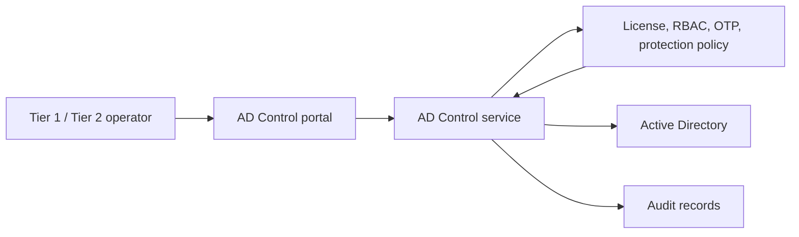
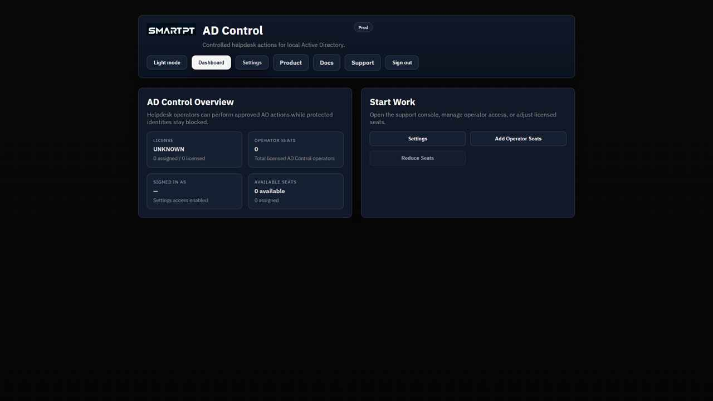

# Getting Started with AD Control

AD Control gives support teams a controlled way to reset passwords, unlock accounts, update selected user attributes, and manage approved group membership without exposing Tier 0 accounts to routine helpdesk work.

The business problem is simple: password reset and account unlock are common helpdesk actions, but they are also common social-engineering targets. AD Control reduces that risk by separating routine operators from protected identities, enforcing role-based workflows, and auditing sensitive actions.

## What AD Control Solves

- Helpdesk users should not need broad Active Directory rights.
- Tier 0 and protected identities should not appear in routine support workflows.
- Password reset and account unlock should be direct only when policy allows it.
- Verified actions should use OTP sent to AD-sourced contact details.
- Profile and group changes should be limited to approved Tier 2 workflows.
- Sensitive actions should create audit records.

## Core Model

| Area | Purpose |
|---|---|
| Tier 1 | Routine helpdesk actions such as password reset and account unlock. |
| Tier 2 | Advanced support actions such as profile updates and controlled group management. |
| Protected users | Specific accounts hidden from Tier 1 and Tier 2 search and actions. |
| Protected groups | Groups whose members, including nested members, are treated as protected. |
| Settings access | Administrative access for license assignment, RBAC, protection, OTP, SMTP, and policy. |

## Demo Roles Used In This Documentation

| User | Role | Purpose |
|---|---|---|
| jim | Settings administrator | Full AD Control settings access. |
| david | Helpdesk (Tier 1) | Can support standard users such as avi. |
| sara | Advanced Support (Tier 2) | Can support standard users and use Tier 2 actions. |
| avi | Managed user | Target user for operator workflows. No AD Control license required. |
| joe | Protected user | Hidden from Tier operators after protection is configured. |

Only operators need AD Control product licenses. Target users such as avi do not need a license to be managed.

## Recommended Learning Order

1. Access Model, Licensing, and RBAC
2. Portal Overview
3. Settings Overview
4. Protected Users and Groups
5. Operator Support Console
6. Password Reset Workflows
7. Profile Updates
8. Controlled Group Management
9. Troubleshooting
