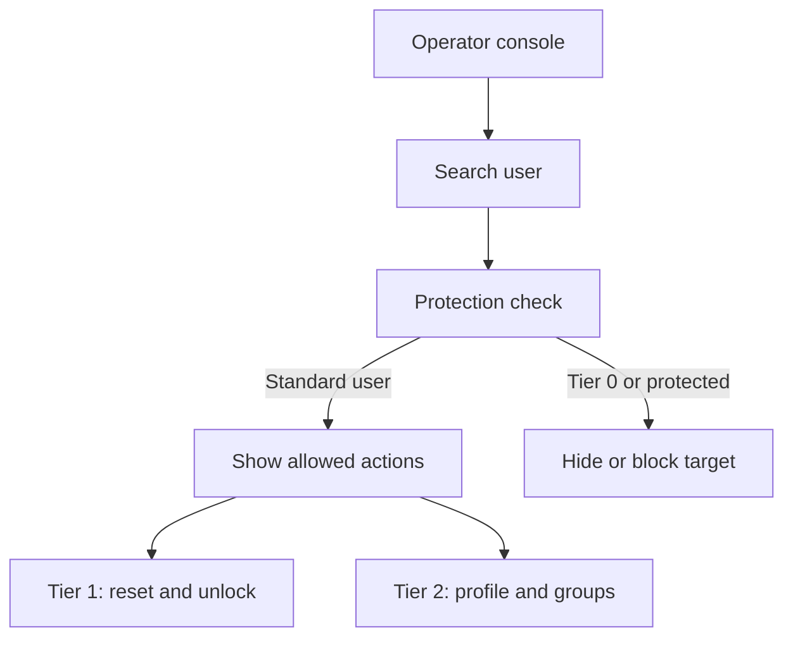

# Operator Support Console

Operators use the AD Control tab to search Active Directory users and run only the actions allowed by their assigned role.

## Search

Operators can search by samAccountName, UPN, or display name.

Protected users and protected group members should not appear to Tier operators. If a user is missing from search, check protection rules before treating it as a directory issue.

## Selected User Panel

After selecting a user, the console shows:

- target user identity
- email, phone, and mobile attributes from Active Directory
- enabled/disabled status
- locked status
- password last set time
- available actions based on the operator role

## Tier 1 vs Tier 2

| User | Role | Visible workflow |
|---|---|---|
| david | Helpdesk (Tier 1) | Reset password and unlock standard users. |
| sara | Advanced Support (Tier 2) | Reset/unlock plus profile and group actions. |

