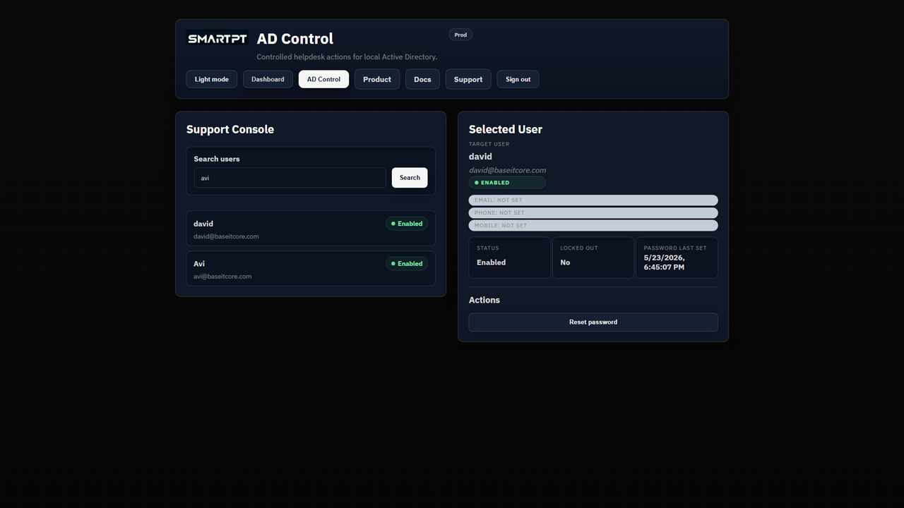

# Use the AD Control operator console

Use the operator console to find a standard Active Directory user and run only the actions available to your assigned role.

## Search for a user

1. Open **AD Control**.
2. Search by `samAccountName`, UPN, or display name.
3. Select the target user.

Protected users and protected group members do not appear to Tier 1 or Tier 2 operators.

## Selected user information

The selected-user panel can show identity, Active Directory email and phone attributes, enabled state, lock state, password-last-set time, and the actions allowed by the operator role.

## Actions by role

| Role | Available actions |
| --- | --- |
| **Helpdesk (Tier 1)** | Password reset and account unlock for standard users. |
| **Advanced Support (Tier 2)** | Tier 1 actions plus approved profile updates and controlled group membership. |

## Verify the console

- Confirm Tier 1 cannot edit profile attributes, change phone numbers, or manage groups.
- Confirm Tier 2 sees only the approved profile and group actions.
- Confirm Tier 0 and protected identities are not searchable.
- Review the audit record after a sensitive action.

## Related pages

- [Password reset](./password-reset-workflows.md)
- [Account unlock](./account-unlock-workflows.md)
- [Protected users and groups](./protected-users-groups.md)
