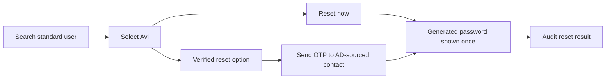

# Password Reset Workflows

AD Control supports direct reset and verified reset. Administrators decide which methods are enabled in Settings.

## Direct Reset

Direct reset is an administrator-approved helpdesk action. It runs immediately and is audited.

Use direct reset when policy allows the operator to reset the target user without OTP verification.

## Verified Reset

Verified reset requires OTP before the password reset completes.

The operator selects an available delivery channel, sends OTP, enters the code provided by the user, and completes the reset.

OTP delivery uses AD-sourced contact attributes. Operators cannot type arbitrary delivery addresses or phone numbers in the reset dialog.

## Password Handling

Generated passwords are shown once after reset. Copy or deliver the password immediately using the approved workflow.

Audit records should include the action, actor, target, result, and correlation ID, but not the generated password or OTP code.
