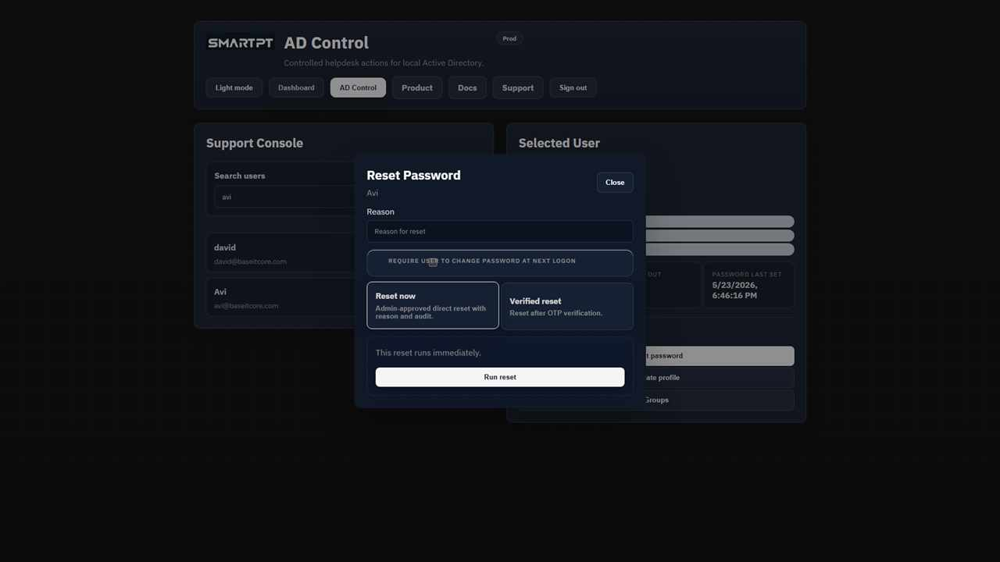
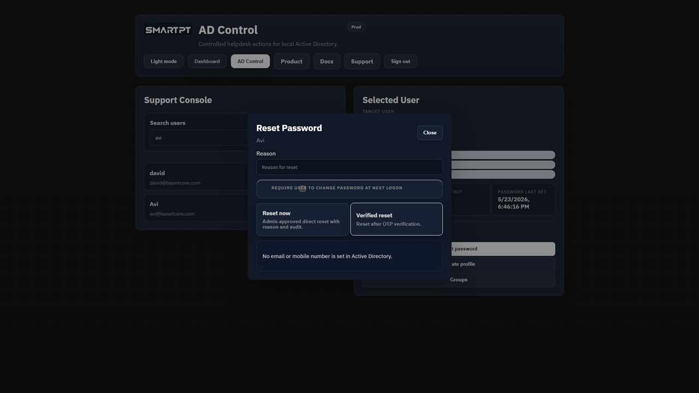
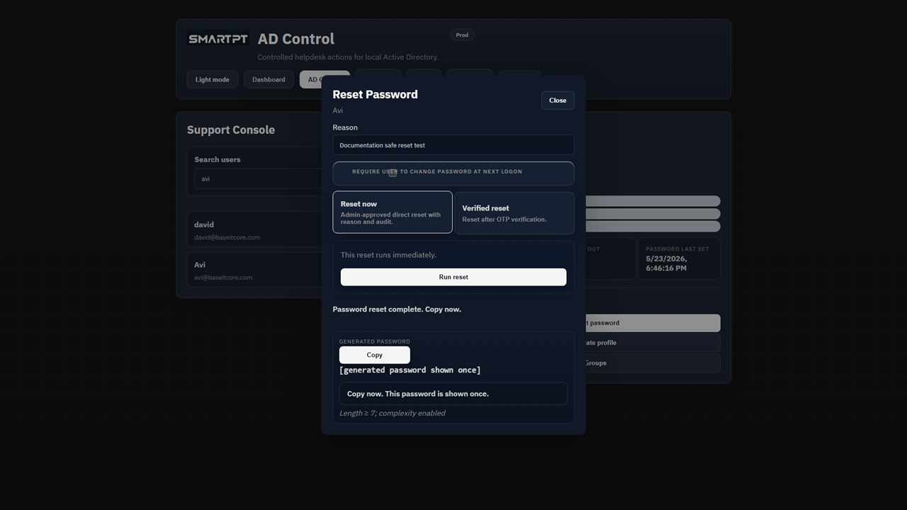

# Reset an Active Directory password

AD Control supports direct reset and OTP-verified reset when those methods are enabled in Settings.

## Before you begin

- The operator needs an AD Control license and an allowed Tier 1 or Tier 2 role.
- The target user must be a standard, non-protected account.
- OTP-verified reset requires an enabled delivery channel and the corresponding Active Directory contact attribute.

## Direct reset

1. Search for and select the target user.
2. Click the direct password reset action.
3. Review the target and required reason.
4. Confirm the reset.

## OTP-verified reset

1. Search for and select the target user.
2. Choose the verified reset option.
3. Select an available delivery channel.
4. Send the OTP to the Active Directory contact value.
5. Enter the code provided by the user.
6. Confirm the reset.

Operators cannot enter a different delivery address or phone number. Mobile OTP uses the Active Directory `mobile` attribute. International numbers require the country prefix; `+` is optional. Israel numbers may omit `972`.

## Expected result

AD Control resets the password and shows the generated password once.

Deliver the password through the customer's approved process. The generated password and OTP code must not appear in audit logs.

## Verify the reset

Confirm the success result in the portal and review the audit record for the actor, target, method, result, and available detail.
