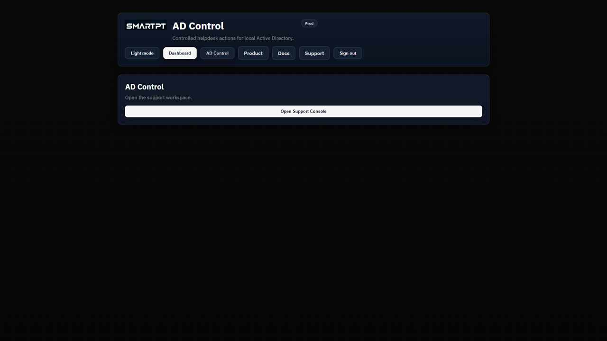

# AD Control portal overview

The AD Control portal shows the dashboard, operator console, or Settings according to the signed-in user's access.

## Dashboard

The dashboard confirms the signed-in user and provides the available product actions.

## Portal areas

| Area | Available to | Purpose |
| --- | --- | --- |
| **Dashboard** | Licensed users and administrators | Shows product status and available entry points. |
| **AD Control** | Licensed Tier 1 and Tier 2 operators | Searches standard users and shows role-approved actions. |
| **Settings** | Settings administrators | Manages access assignments, protected identities, OTP, action policy, SMTP, and sessions. |
| **Product**, **Docs**, **Support** | Signed-in users | Opens SmartPT product, documentation, and support resources. |

Tier 1 and Tier 2 operators do not see **Settings** unless they also have settings access. Settings access does not by itself assign an operator license.

## Verify portal access

- Sign in as a Tier 1 operator and confirm reset and unlock actions are available.
- Sign in as a Tier 2 operator and confirm approved profile and group actions are also available.
- Sign in as a settings administrator and confirm **Settings** is visible.

## Related pages

- [Operator console](./operator-console.md)
- [Settings overview](./settings-overview.md)
