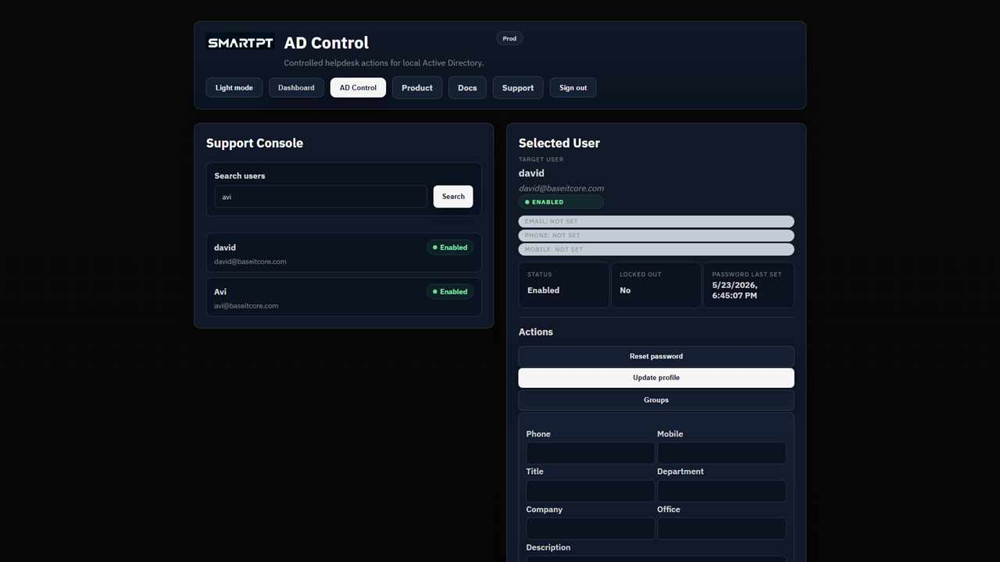

# Update approved user profile fields

Advanced Support (Tier 2) operators can update supported Active Directory attributes for standard users.

## Before you begin

- The operator needs an AD Control license and **Advanced Support (Tier 2)**.
- The target user must not be Tier 0 or protected.
- Confirm that AD Control is the approved system for changing the selected attribute.

## Supported fields

- Phone
- Mobile
- Title
- Department
- Company
- Office
- Description

## Update the profile

1. Search for and select the target user.
2. Open the profile update action.
3. Change only the approved fields.
4. Save the update.

## Expected result

The selected Active Directory attributes show the saved values.

## Verify the update

Refresh the selected user and review the profile-update audit record. Protected users remain unavailable to this workflow.
