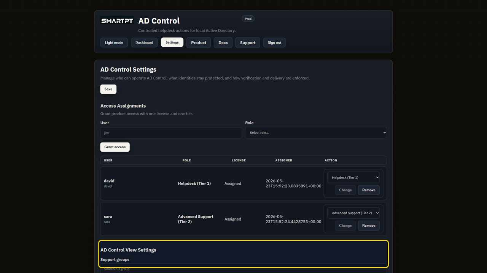
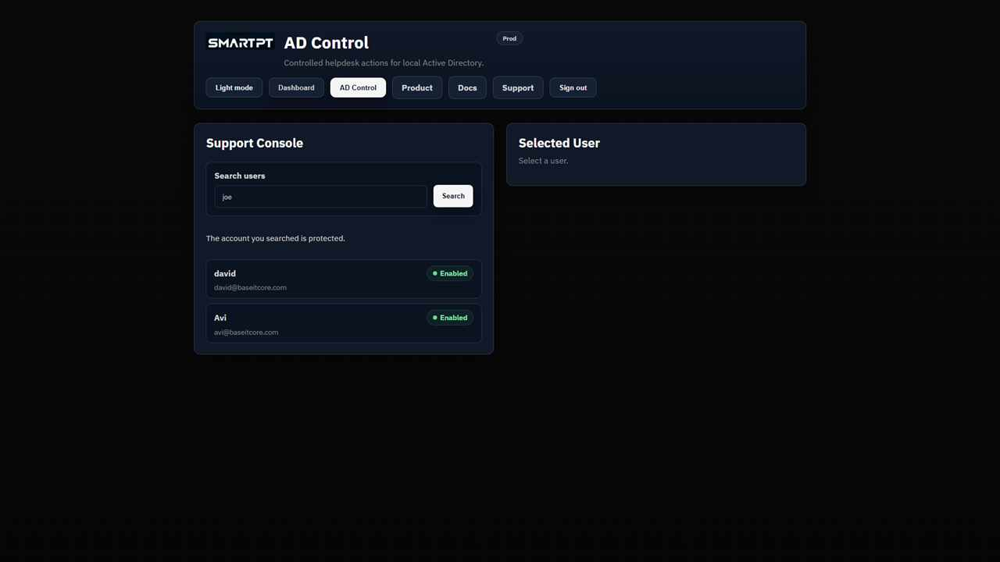

# Configure protected users and groups

Protected identities do not appear in Tier 1 or Tier 2 user search and cannot be selected for operator actions.

Tier 0 identities are protected by default. Administrators can also add named users and Active Directory groups. Protection applies to direct and nested members of protected groups.

## Before you begin

- Identify Tier 0, break-glass, service-owner, and other accounts that must remain outside helpdesk workflows.
- Identify the Active Directory groups whose members require protection.
- Use Tier 1 and Tier 2 test accounts to verify the result.

## Add protection

1. Open **Settings**.
2. Add named accounts under **Protected users**.
3. Add the required Active Directory groups under **Protected groups**.
4. Save the settings.

## Expected result

Tier 1 and Tier 2 operators cannot find the protected user or a direct or nested member of a protected group.

## Verify protection

1. Sign in as a Tier 1 operator and search for each protected identity.
2. Repeat with a Tier 2 operator.
3. Confirm standard test users remain searchable.
4. Review audit details for blocked or protected searches when available.

Protection applies to AD Control operator workflows. Do not assume it changes permissions in other Active Directory tools.
