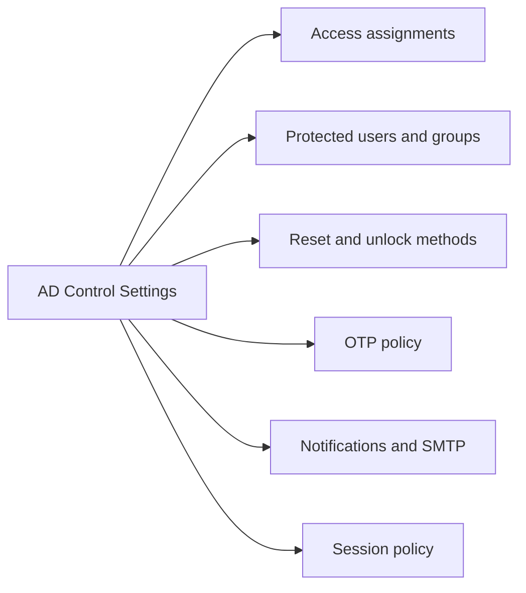
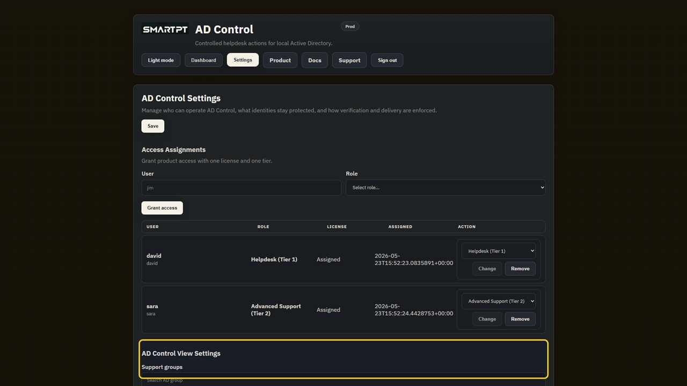
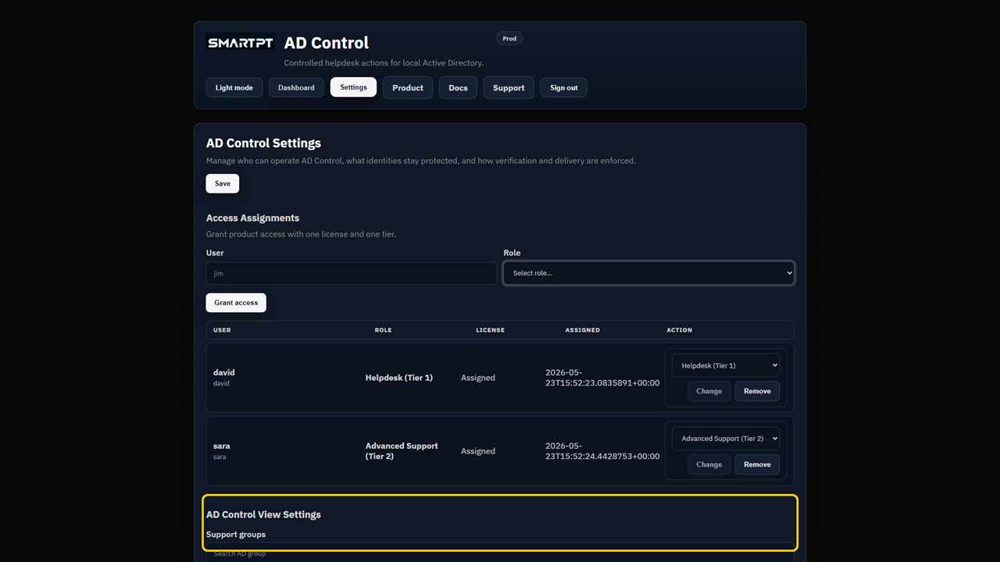

# Settings Overview

AD Control Settings is the administrative area for product access, role assignment, protected identities, OTP policy, password/unlock behavior, SMTP, and session policy.

Only users with settings access should manage this page.

## Settings Sections

| Section | Purpose |
|---|---|
| Access Assignments | Assign licenses and operator roles. |
| AD Control View Settings | Configure support groups, protected users, and protected groups. |
| OTP / verification policy | Control code lifetime, send limits, resend windows, and failed attempt limits. |
| Password and unlock options | Enable or disable direct password reset, OTP-verified password reset, direct unlock, and OTP-verified unlock. |
| Notifications | Configure auditor email and reset/unlock notifications. |
| Global Email (SMTP) | Configure SMTP delivery for email-based workflows. |
| System / Session | Control portal session duration and idle timeout. |

## Settings Callouts

Yellow callouts in the screenshots mark the areas administrators should review first.

Recommended first pass:

1. Confirm operator license and role assignments.
2. Configure protected users and protected groups.
3. Review direct vs verified reset and unlock methods.
4. Configure OTP limits.
5. Configure SMTP and auditor notifications.
6. Test with a non-privileged AD user before production use.

## What Administrators Can Configure

| Setting area | What the administrator controls |
|---|---|
| Access Assignments | Operator license assignment, role selection, role changes, and removal. |
| Support groups | AD groups that should receive AD Control view/settings permissions. |
| Protected users | Specific accounts hidden from Tier 1 and Tier 2 workflows. |
| Protected groups | Groups whose direct and nested members are treated as protected. |
| OTP TTL and resend policy | How long OTP is valid and how often it can be resent. |
| Verification limits | Send limits, policy window, and failed attempt limits. |
| Password reset options | Direct reset, verified reset, change-at-next-logon, complexity, and custom length. |
| Unlock options | Direct unlock and verified unlock availability. |
| WhatsApp/mobile OTP | Whether mobile delivery is available for OTP workflows. |
| Auditor email | Recipient for sensitive workflow notifications. |
| Templates | Email subject and body text for verification messages. |
| Session policy | Portal maximum session and idle timeout. |
| SMTP | Mail relay, sender, port, TLS, authentication reference, and timeout. |

Settings changes affect production operator behavior. Review protected identities and OTP delivery before enabling broad operator access.
