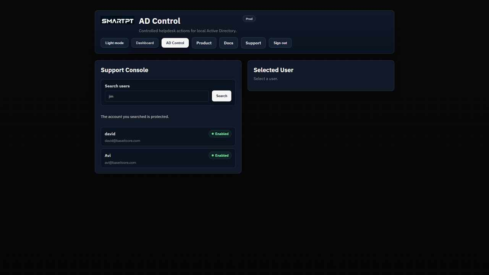

# AD Control Troubleshooting

Use this page when access, search, OTP, reset, unlock, profile, group, SMTP, or settings behavior does not match expectations.

## Operator Cannot Access AD Control

Check:

- The user has an AD Control license assignment.
- The user has one operator role.
- The license has available seats.
- The user is signing in with the expected AD identity.

Jim-style settings administrators may have Settings access without being licensed as an operator.

## Target User Does Not Appear In Search

Check:

- The target exists in Active Directory.
- The target is not Tier 0.
- The target is not in protected users.
- The target is not a direct or nested member of a protected group.

This is expected for protected accounts such as joe or Tier 0 accounts such as jim.

## OTP Cannot Be Sent

Check:

- AD mail and mobile attributes exist for the target user.
- The selected delivery channel is enabled.
- SMTP is configured when using email.
- WhatsApp/mobile delivery is enabled when using mobile.
- OTP send limits and resend windows have not been reached.

## SMTP Or Notification Failure

Check:

- SMTP host, port, sender, TLS, and credential reference.
- Firewall access from the AD Control server to the relay.
- Whether the mail system requires MFA or interactive authentication.
- Auditor email and notification settings.

## IIS Or Backend Issue

Check that the AD Control frontend and backend IIS applications are running:

- AD Control frontend: `/adc`
- AD Control backend: `/adc-backend`

The backend is designed to run with the pre-installed gMSA/service identity. Do not change the application pool identity unless deployment guidance requires it.

