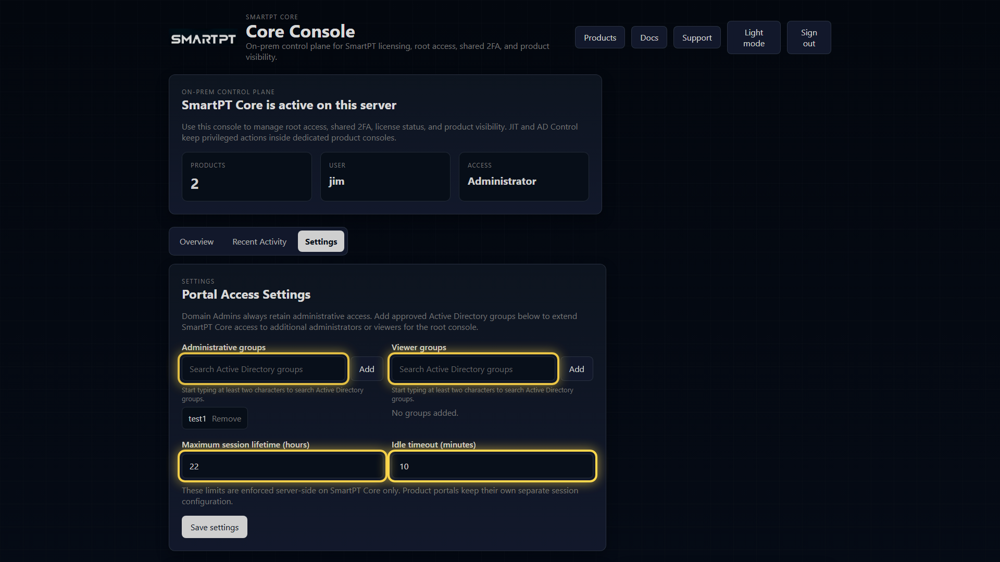
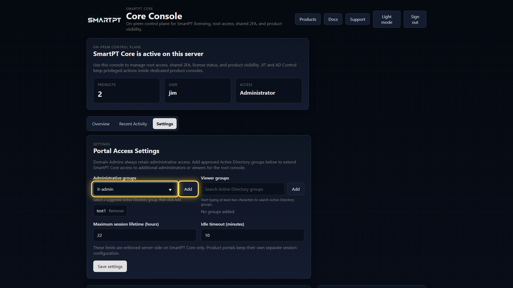

# Access Model, RBAC, and Admin Groups

SmartPT Console access is controlled by Active Directory identity, group membership, and the built-in Domain Admin fallback.

## Access Levels

| Access level | Who gets it | What it can do |
| --- | --- | --- |
| Administrator | Domain Admins or configured Administrative groups | View products, view activity, manage settings, reset shared 2FA, and view license status. |
| Viewer | Configured Viewer groups | View the Console without managing settings. |
| None | Users outside allowed groups | Access is denied. |

Domain Admins always retain administrative access. This prevents lockout during initial setup, but day-to-day administration should use approved AD groups.

## Administrative Groups

Add an AD group when non-Domain Admin operators should administer SmartPT Console. For example, an `it-admin` group can be granted Console administrator access.

Recommended practice:

- Use a dedicated AD group for SmartPT Console administrators.
- Keep product-specific roles inside JIT Access and AD Control.
- Do not use Console access as a substitute for product RBAC.
- Review group membership regularly.

## Viewer Groups

Viewer groups are useful for operators who need visibility into product status and recent activity but should not reset 2FA, change settings, or manage license actions.

## Session Policy

Console session limits are enforced for SmartPT Console only. Product portals keep their own session configuration.

