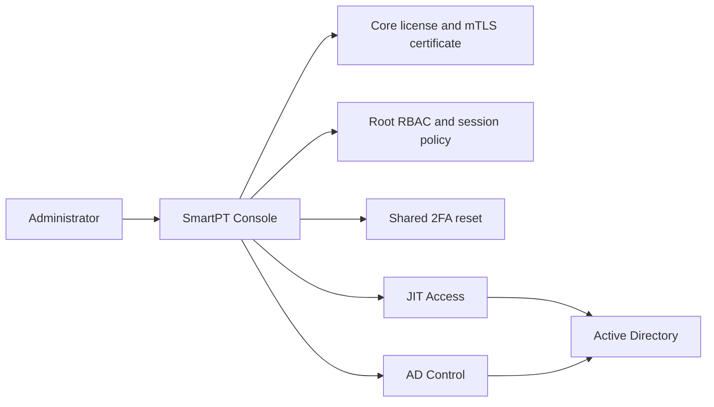

# Getting Started with SmartPT Console

SmartPT Console is the root portal for a SmartPT server. It gives administrators one place to confirm product availability, review license and certificate health, manage root portal access, reset shared two-factor enrollment, and open the product consoles.

SmartPT Console does not replace JIT Access or AD Control. Product actions stay inside the product portals. The Console is the root entry point for license status, product access, administrator access, and shared MFA recovery.

## What Problem This Solves

SmartPT deployments include multiple local portals and backend services. Without a root console, administrators need to check each product separately to answer basic operational questions:

- Is the server license active?
- Are JIT Access and AD Control reachable?
- Who can administer the root portal?
- Is shared two-factor enrollment working?
- Is the client certificate healthy?
- Where do operators go next?

SmartPT Console gives administrators a single operational starting point before they enter product-specific workflows.

## How SmartPT Console Fits

## What To Configure First

1. Confirm the Core license is **ACTIVE**.
2. Confirm certificate renewal status is healthy.
3. Confirm JIT Access and AD Control show as reachable.
4. Add the correct administrative group for Console access.
5. Configure viewer groups only if read-only operators need visibility.
6. Review session lifetime and idle timeout.
7. Test shared two-factor reset with a non-production user.

Recommended order:

1. Console Portal Overview
2. License, Product Status, and mTLS
3. Access Model, RBAC, and Admin Groups
4. Settings Overview
5. Shared 2FA and Reset MFA
