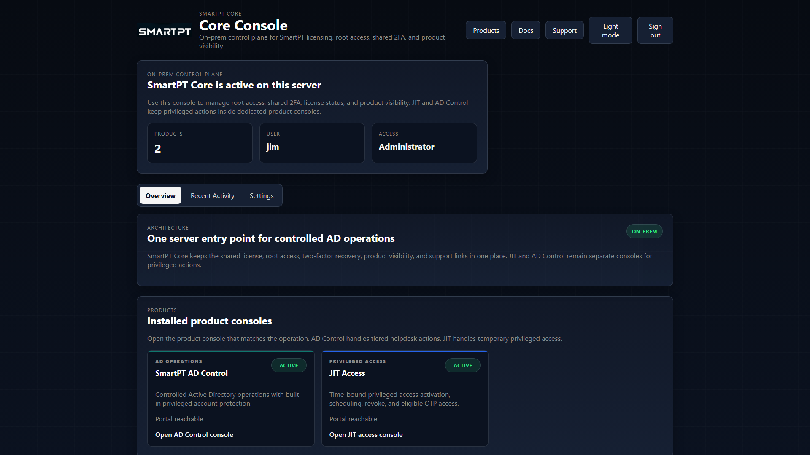
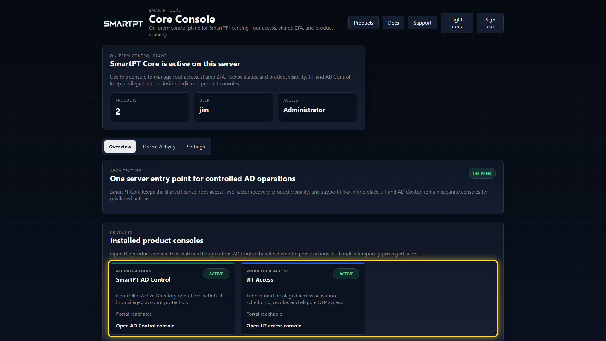
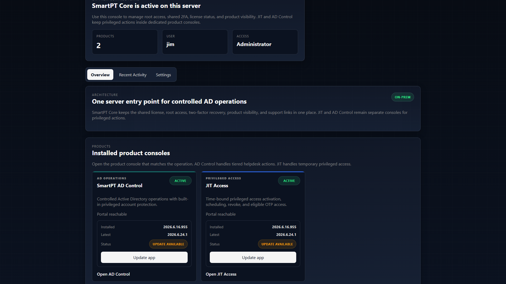
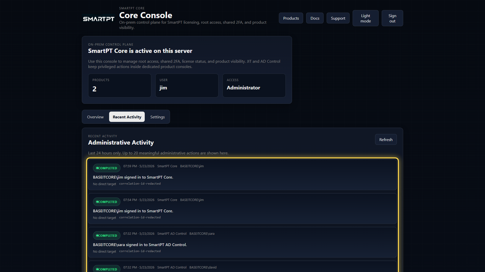

# SmartPT Console Portal Overview

The SmartPT Console portal is split into three main areas: **Overview**, **Recent Activity**, and **Settings**. The exact tabs depend on the signed-in user's access level.

## Overview

Overview is the first readiness view after sign-in. Use it to confirm the server is active, the signed-in user has the expected access level, and product consoles are reachable.

| Area | Purpose |
| --- | --- |
| Products | Counts installed product portals visible from the Console. |
| User | Shows the signed-in identity. |
| Access | Shows whether the user is Administrator or Viewer. |
| Architecture | Explains the Console boundary: root portal status and access, not product workflow execution. |
| Installed product consoles | Opens JIT Access and AD Control. |

## Product Status

Product cards show whether each portal is reachable from the Core server. This is a fast operational check before entering JIT Access or AD Control.

If a product is unavailable, troubleshoot the product frontend/backend and IIS application before testing product workflows.

## Product App Updates

Core administrators can update AD Control and JIT Access from the product cards when the configured update source reports a newer package. Viewer users can open product consoles when their access allows it, but they cannot run product updates.

Update behavior:

1. Core checks the update manifest from the configured update source.
2. Core compares the installed package state with the latest package version and SHA.
3. If a newer package exists, the product card shows **Update available**.
4. The administrator selects **Update app**.
5. Core downloads the product frontend and backend ZIP files.
6. Core verifies SHA256 before applying the package.
7. Core creates a local backup of the current application files.
8. Core stops the related IIS application pools.
9. Core replaces application files only.
10. Core restarts the application pools and checks frontend/backend health.

Settings, license files, state, logs, and customer data are not overwritten by product updates. If an update fails, Core restores the previous files from the local backup and marks the update as failed or rolled back.

## Recent Activity

Recent Activity shows sign-ins, settings changes, password resets, account unlocks, JIT assignments, session changes, and revoke events. Use it for quick operational review and correlation ID lookup.

Recent Activity is not a replacement for full audit retention. It is a quick view for administrators during support and validation.

## Settings

Settings is available only to Console administrators. It controls root portal access, Console session policy, shared two-factor reset, license visibility, support links, and subscription cancellation.

