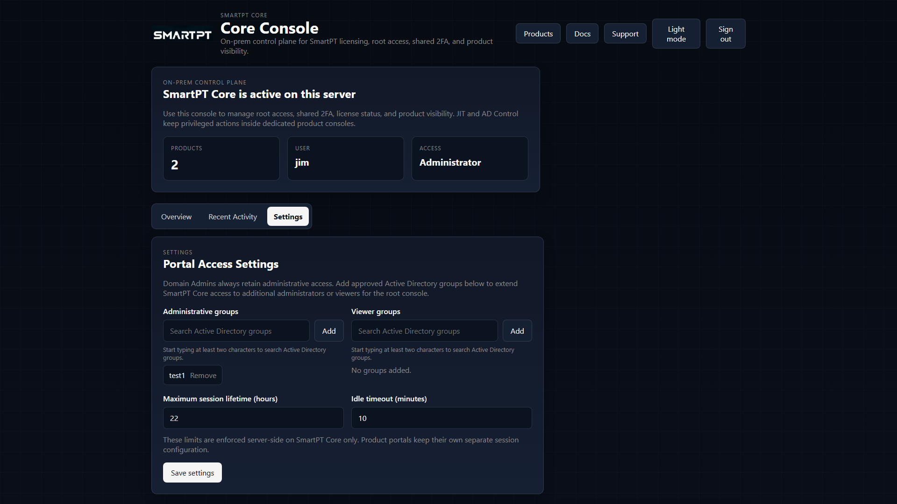
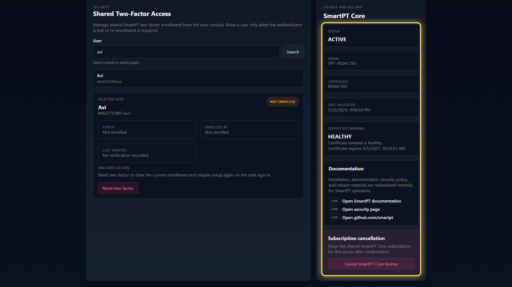

# SmartPT Console Settings Overview

Settings is the administrative area for root portal access, shared two-factor recovery, license visibility, mTLS status, and subscription actions.

## Portal Access Settings

Portal Access Settings controls who can administer or view SmartPT Console.

| Setting | Purpose |
| --- | --- |
| Administrative groups | AD groups that receive Console administrator access. |
| Viewer groups | AD groups that receive read-only Console visibility. |
| Maximum session lifetime | Hard limit for a Console session. |
| Idle timeout | Inactivity limit for a Console session. |

## Shared Two-Factor Access

Shared Two-Factor Access lets an administrator inspect and reset a user's shared authenticator enrollment. Use it when the authenticator is lost, replaced, or re-enrollment is required.

Resetting two-factor does not grant product permission. It only clears the shared 2FA enrollment so the user must enroll again on the next sign-in.

## License and Billing

License and Billing shows the Core license state, serial, mTLS certificate thumbprint, last validation time, certificate renewal status, documentation links, and subscription cancellation action.

Use subscription cancellation carefully. It affects the shared Core subscription and can block access to JIT Access and AD Control when the license is no longer active.

