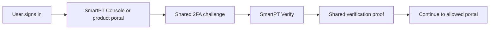
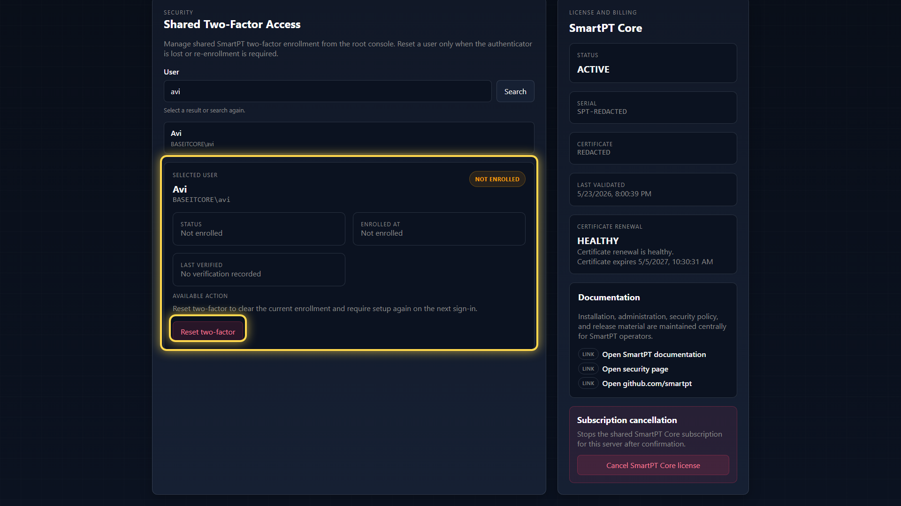

# Shared 2FA and Reset MFA

SmartPT Console can reset a user's shared two-factor enrollment. This is used when a user loses the authenticator app, changes device, or must be forced to re-enroll.

## How Shared 2FA Works

The shared verification proof is separate from product authorization. Passing 2FA does not grant JIT or AD Control permissions by itself.

## Reset MFA For A User

1. Sign in to SmartPT Console as a Console administrator.
2. Open **Settings**.
3. In **Shared Two-Factor Access**, search for the AD user.
4. Select the user.
5. Review enrollment status.
6. Select **Reset two-factor** only when re-enrollment is required.

After reset, the user must enroll again on the next sign-in. The reset is an administrative recovery action and should be audited.

## What To Check Before Reset

- Confirm the target user is correct.
- Confirm the request is approved by the customer's process.
- Confirm the user understands they will need to enroll again.
- Do not reset 2FA as a workaround for missing product RBAC or license assignment.

