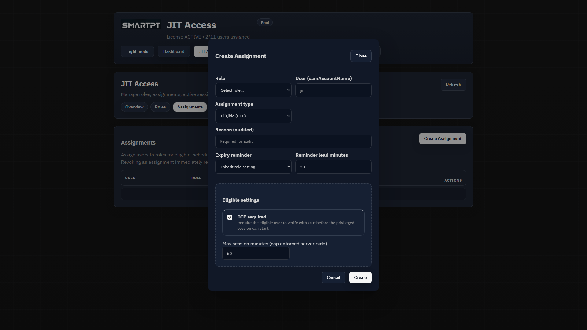
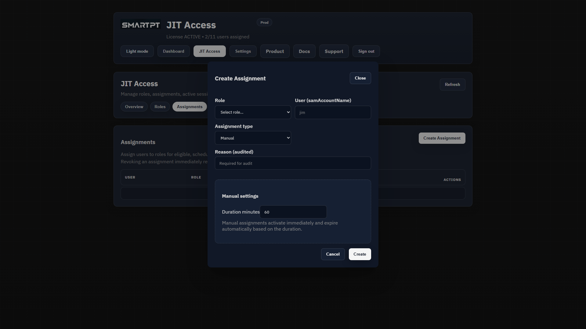
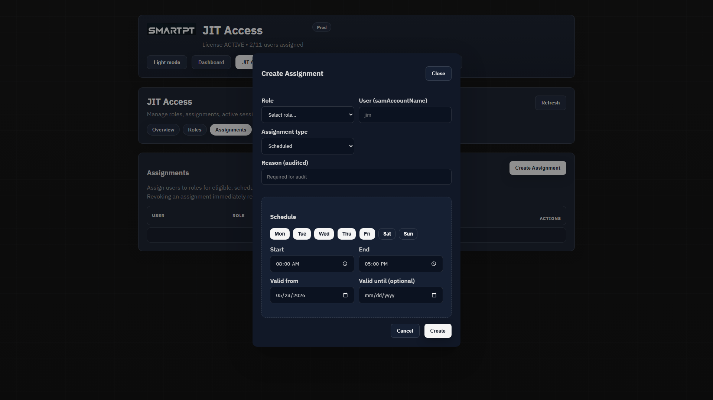

# Creating JIT Assignments

Assignments connect users to JIT roles. They define who can receive privileged access, how access starts, and when it ends.

Open **JIT Access > Assignments** to review existing assignments or create a new one.

## Create Assignment

Select **Create Assignment**.

Every assignment requires:

- A JIT role.
- A target user by `samAccountName`.
- An assignment type.
- A reason for audit.

## Assignment Types

| Type | Behavior |
| --- | --- |
| Eligible | User is approved to activate access with OTP. Access starts only after successful verification. |
| Scheduled | SmartPT grants and removes access automatically during configured time windows. |
| Manual | Administrator grants immediate access for a fixed duration. |

## Manual Assignment

Manual assignments activate immediately and expire automatically.

Use manual assignments for urgent operational work, incident response, or one-time maintenance where an administrator is intentionally granting access now.

## Scheduled Assignment

Scheduled assignments are enforced by SmartPT.

Use scheduled assignments for recurring maintenance windows. SmartPT adds membership during the allowed window and removes it outside the window.

## Eligible Assignment

Eligible assignments allow approved users to activate access themselves with OTP verification.

Use eligible assignments when a user is trusted for a role but should not have active privilege until they explicitly verify and start a session.

## Revoke

Revoking an assignment immediately removes the user from the mapped AD group or prevents the assignment from being used again, depending on assignment state.

Use revoke when access is no longer needed, was configured incorrectly, or must be stopped before the expected end time.

## No Approval Workflow

This release does not include an approval workflow. Assignment creation is an administrator action. Eligible OTP verifies the user before activation, but it is not a manager or security approval process.
