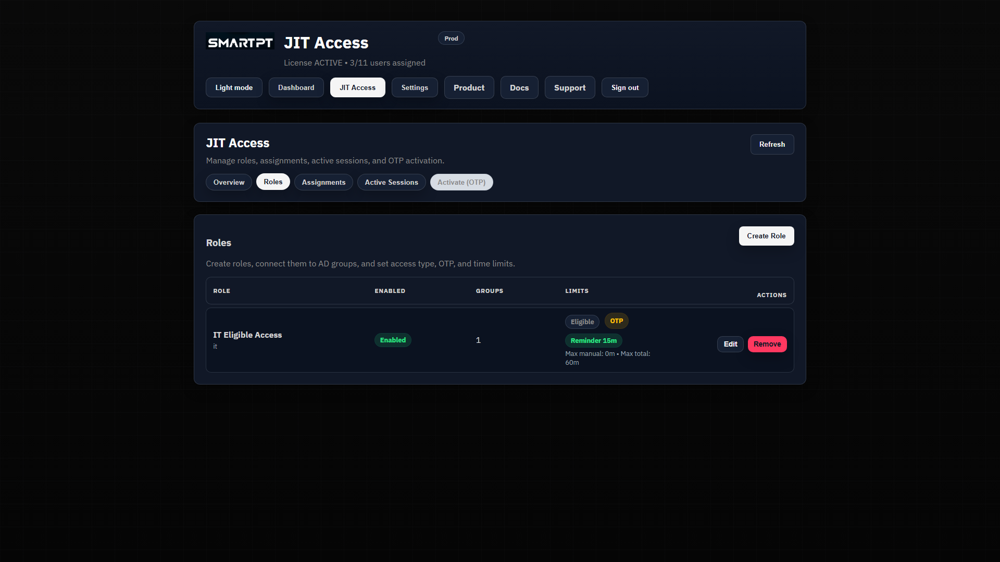
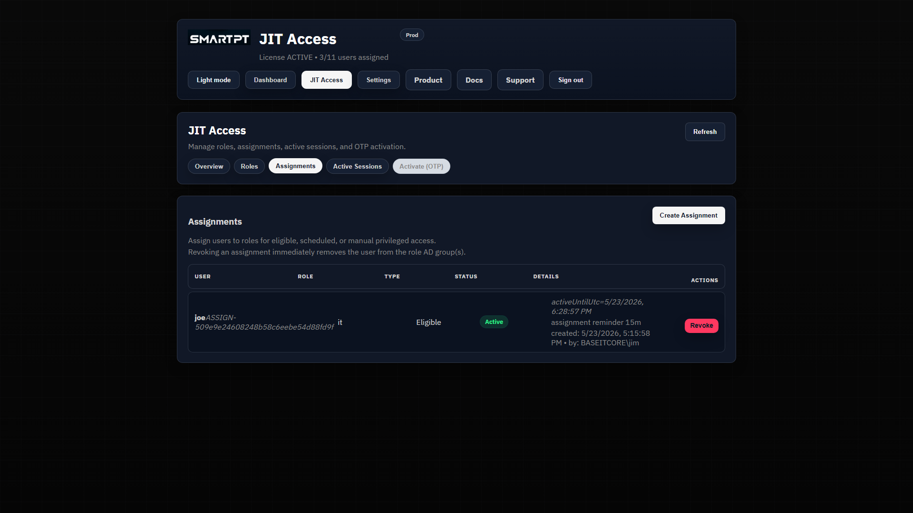
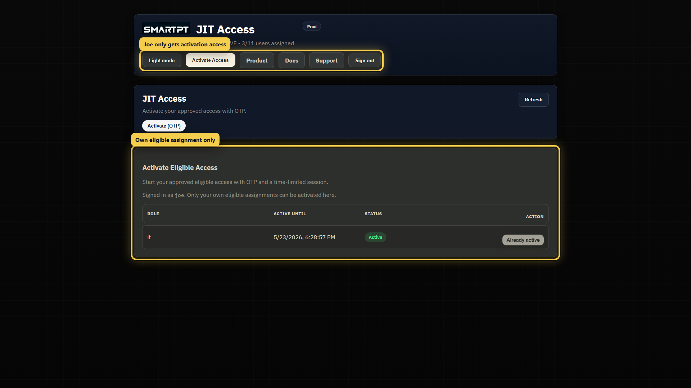
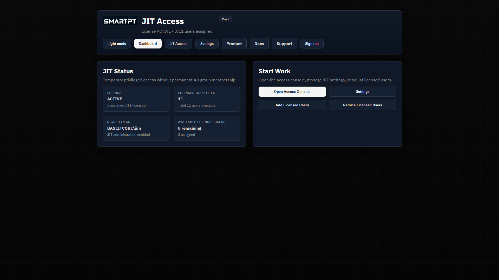
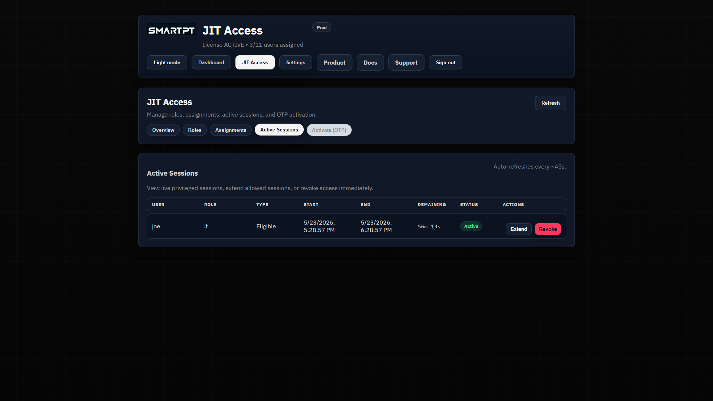

# Eligible OTP Self-Service

Eligible OTP access lets an approved user activate temporary privileged access without holding standing membership in the target Active Directory group.

The administrator prepares the access path. The user activates it only when needed, verifies with OTP, and receives a time-limited session. JIT Access then removes access automatically when the session expires or when an administrator revokes it.

## What This Flow Solves

Eligible access is useful when a user is trusted for a privileged role but should not remain a permanent member of the AD group.

For example, an operator may be allowed to use an IT administration role during support work, but the account should not sit permanently in the mapped AD group. Eligible OTP keeps the user inactive until they explicitly start a verified session.

## End-to-End Flow

1. A JIT administrator assigns a product license to the user.
2. The administrator creates or confirms a JIT role that allows **Eligible** access and requires OTP.
3. The administrator creates an Eligible assignment for the user.
4. The user signs in to the JIT portal.
5. The user opens **Activate Access** and starts the assigned role.
6. JIT Access sends OTP to an AD-sourced delivery channel, such as WhatsApp/mobile.
7. The user verifies the OTP.
8. JIT Access activates the session and adds the user to the mapped AD group.
9. A JIT administrator monitors the active session.
10. Access expires automatically or can be revoked early.

## Administrator Setup

The administrator must prepare both product access and JIT access.

Required setup:

- Assign the user a JIT product license.
- Create or confirm a JIT role.
- Enable **Allow eligible** on the role.
- Enable **OTP required** when verification is required.
- Map the role to the existing AD group that should be controlled.
- Create an Eligible assignment for the target user.

The role should clearly show Eligible and OTP behavior. Keep the role purpose narrow and use a short maximum duration for privileged access.

The assignment connects the user to the role. The assignment remains inactive until the user verifies and activates it.

## User Activation

The user signs in with their own account and sees only the access they are allowed to activate.

Joe does not see administrator settings, roles, assignments, or session management. His portal is limited to **Activate Access**, product links, docs, support, and sign out.

When the role is inactive, the user sees an **Activate** option. Opening it shows the OTP activation dialog. The user selects the allowed delivery channel, sends OTP, enters the code, and verifies.

Important behavior:

- OTP contact details come from Active Directory.
- The user cannot type a new phone number or email address.
- WhatsApp/mobile delivery uses the configured mobile channel.
- Email can be used only when enabled and available.
- OTP verification starts the privileged session.
- OTP does not create a permanent AD group membership.

## Active Session Monitoring

After OTP verification, JIT Access creates an active JIT session. The administrator can confirm it under **JIT Access > Active Sessions**.

The active session view shows:

- User.
- JIT role.
- Assignment type.
- Start time.
- End time.
- Remaining time.
- Status.
- Available actions such as extend or revoke, depending on permissions and assignment type.

## What Happens in Active Directory

When OTP verification succeeds, JIT Access adds the user to the AD group mapped by the JIT role.

When the session expires or is revoked, JIT Access removes the user from that AD group. The backend enforces this behavior server-side. The browser is not the authority for access.

## No Approval Workflow

Eligible OTP is not an approval workflow in this release.

The approval decision happens before the user activates access: an administrator creates the eligible assignment. OTP verifies the user at activation time, but it does not request approval from a manager or security team.

## Operational Checks

If eligible activation does not appear for the user, check:

- The user has a JIT product license assignment.
- The user has an active Eligible JIT assignment.
- The role is enabled.
- The role allows Eligible access.
- The role has OTP configured as expected.
- The user is signing in with the same `samAccountName` used in the assignment.

If OTP cannot be sent, check:

- The AD user has the required mobile or mail attribute.
- The requested channel is enabled.
- Notification and SMTP settings are valid where email fallback is used.
- The backend can reach the configured messaging service.

If activation succeeds but access is not visible, check:

- The mapped AD group DN is correct.
- The backend service identity can add and remove group membership.
- Active Sessions shows the user and role.
- Audit logs include OTP verification and session activation events.
