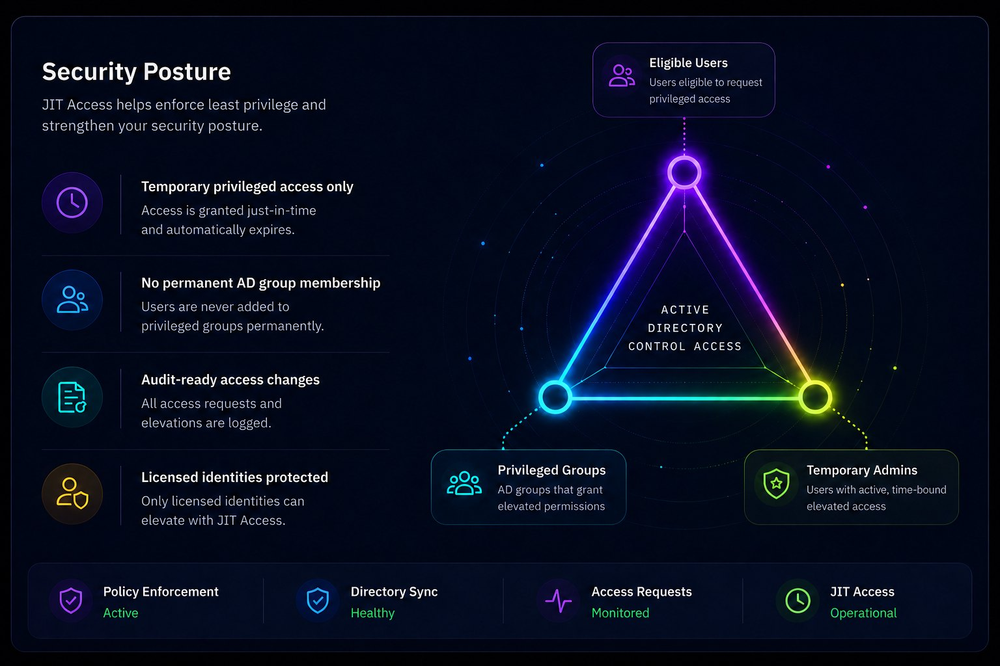

# Get started with JIT Access

JIT Access adds a user to configured Active Directory groups for a limited time and removes the membership when the session expires or is revoked.

## Main components

| Component | Purpose |
| --- | --- |
| JIT role | Maps temporary access to one or more existing Active Directory groups and defines allowed access methods. |
| Assignment | Defines who may receive the role, how it activates, and when it is valid. |
| Active session | Shows temporary access that is currently active. |

A JIT role does not activate access by itself. An assignment must become active before SmartPT adds the user to the mapped groups.

## Assignment types

| Type | Behavior |
| --- | --- |
| Manual | An administrator starts access immediately for a fixed duration. |
| Scheduled | SmartPT starts and removes access during configured time windows. |
| Eligible OTP | An assigned user verifies with OTP and starts a time-limited session. |

> **Important:** JIT Access does not include an approval workflow in this release. Administrators create assignments. Eligible OTP verifies activation but does not create an approval request.

## Before you configure access

- Confirm the JIT license is active.
- Assign product licenses and JIT RBAC roles to the required users.
- Identify the existing Active Directory groups that JIT will manage.
- Confirm the SmartPT service identity can add and remove members from those groups.
- Test with a non-production user and group.

## Recommended order

1. [Review licensing and RBAC](./access-model-licensing-rbac.md).
2. [Review JIT Settings](./settings-overview.md).
3. [Create a JIT role](./roles.md).
4. [Create an assignment](./assignments.md).
5. [Monitor active sessions](./sessions-revoke.md).
