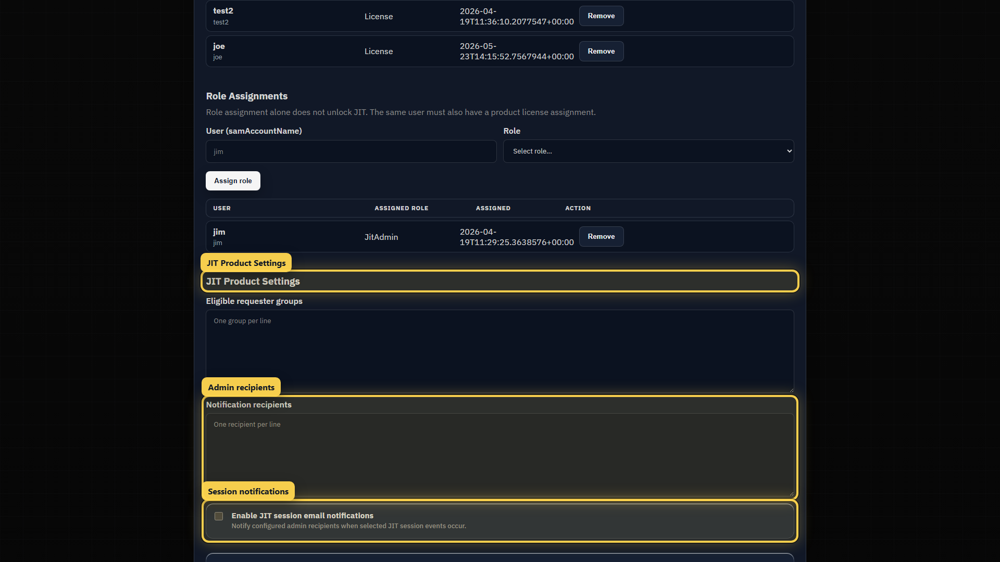
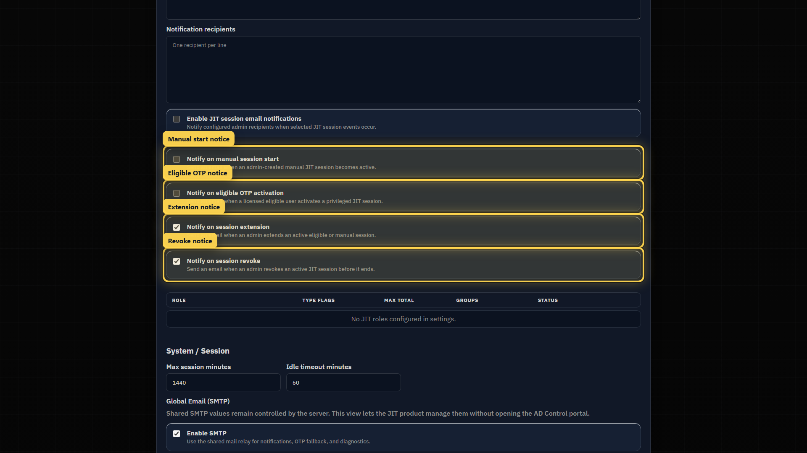
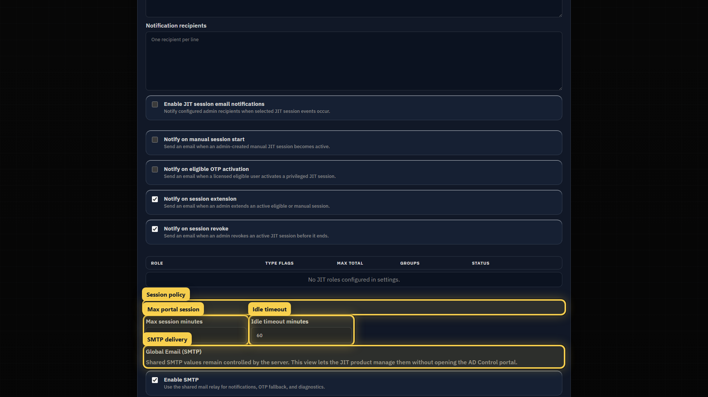

# Configure JIT notifications and session policy

Use these settings to select session email events and define JIT portal session limits.

## Notification recipients

Add the administrators or operational mailboxes that should receive selected session event emails.

## Session event notifications

Available event controls include:

- Manual session start.
- Eligible OTP activation.
- Session extension.
- Session revoke.

## Session policy

| Setting | Description |
| --- | --- |
| **Max session minutes** | Longest JIT portal session. |
| **Idle timeout minutes** | Ends an inactive portal session. |
| **Global Email (SMTP)** | Mail delivery for notifications and configured email fallback. |
| **Group overrides** | Applies different portal session limits to configured groups. |

Portal session limits do not replace JIT role duration limits. Role and assignment settings still control temporary Active Directory access.

## Verify delivery

1. Confirm SMTP host, port, sender, TLS, authentication, and credential reference match the customer relay.
2. Use a non-production role to trigger an enabled event.
3. Confirm the configured recipient receives the message.
4. Review the related audit record.

If delivery fails, check the SMTP relay, firewall, authentication requirements, and recipient configuration before changing the JIT role.
