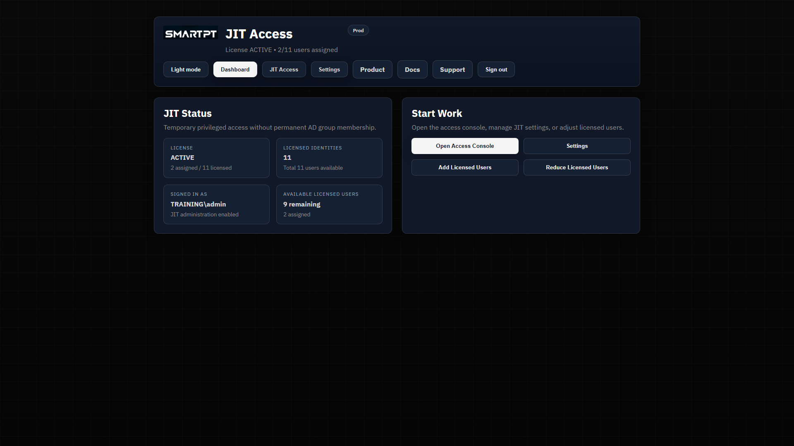
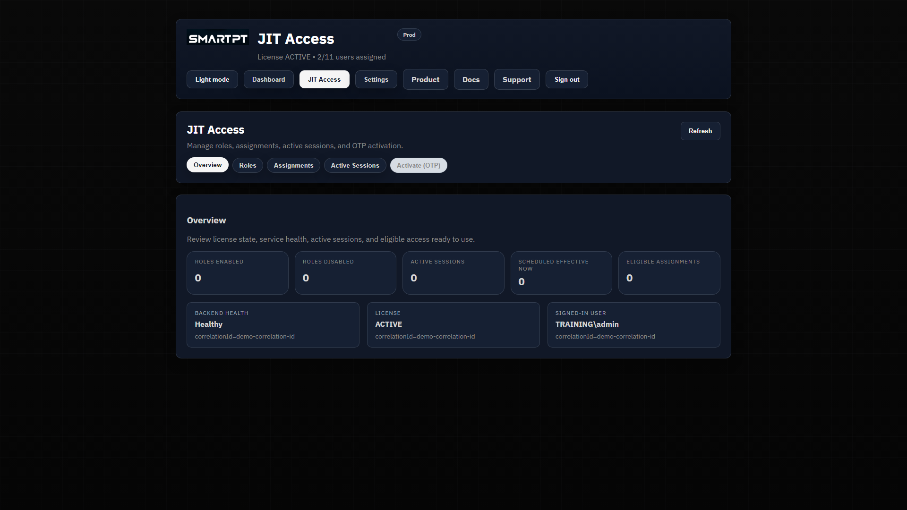
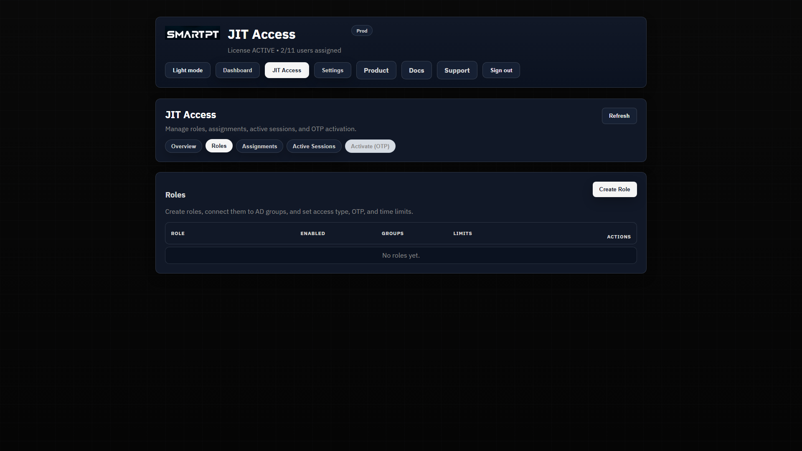
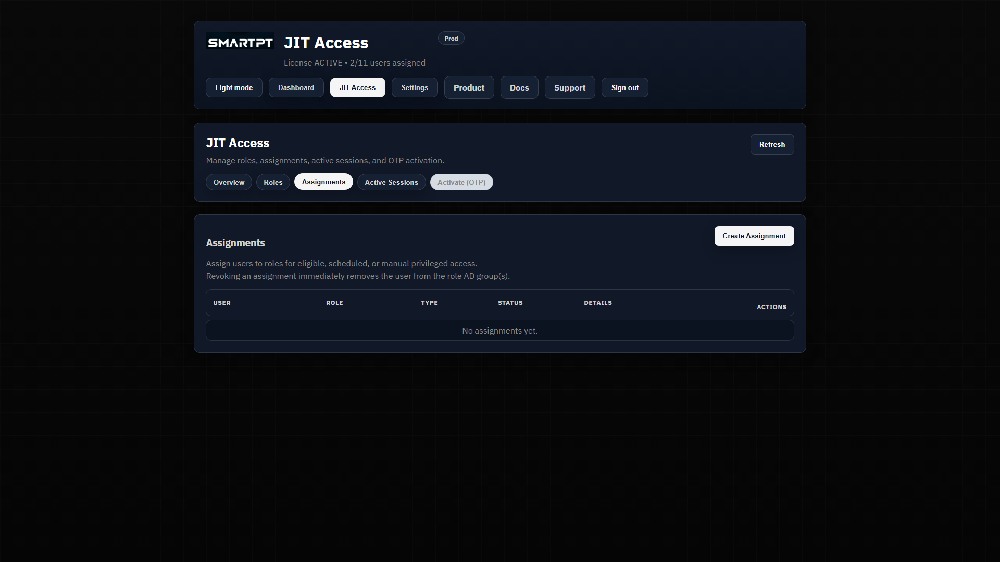
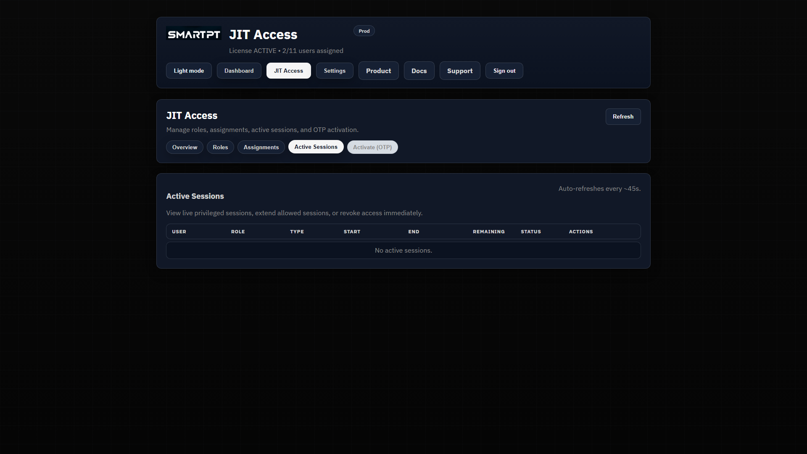

# JIT Portal Overview

The SmartPT JIT portal is the operator workspace for temporary privileged access. It gives administrators one place to confirm license readiness, open the access console, manage settings, review roles and assignments, and monitor active privileged sessions.

The screenshots in this guide were captured from the local JIT portal in dark mode at 1920x1080.

## Dashboard Overview

The dashboard is the first readiness view after sign-in. Use it to confirm that the JIT environment is active before changing access.

The dashboard contains two main areas:

- **JIT Status** shows license state, licensed identity count, signed-in user, and remaining licensed users.
- **Start Work** provides quick actions for opening the JIT access console, settings, and license user management.

### JIT Status Cards

| Card | Purpose |
| --- | --- |
| License | Confirms whether the JIT license is active. JIT operations should not be tested until the license is active. |
| Licensed identities | Shows the total number of users available under the current license. |
| Signed in as | Confirms the current administrator or operator context. |
| Available licensed users | Shows remaining user capacity before additional users must be licensed. |

### Quick Actions

Use the dashboard quick actions for the most common starting points:

- **Open Access Console** opens the JIT workspace for roles, assignments, sessions, and overview metrics.
- **Settings** opens JIT configuration and access assignment settings.
- **Add Licensed Users** increases the licensed user allocation when supported by the current license.
- **Reduce Licensed Users** reduces the licensed user allocation when supported by the current license.

## JIT Access Overview

The JIT Access workspace is the main operational area. The Overview tab summarizes configured access and current activity.

Use this page to answer:

- Are roles configured?
- Are assignments configured?
- Are any sessions active?
- Is there scheduled or eligible access that needs review?
- Is the environment ready for role or assignment work?

The Overview is a checkpoint, not a configuration form. Use it before and after changes to confirm the environment state.

## Roles

Roles define privileged access profiles. A role maps to one or more existing Active Directory groups and controls which access methods are allowed.

Use the Roles tab to review:

- Role display name and stable role ID.
- Whether the role is enabled.
- Allowed access types: Manual, Scheduled, and Eligible.
- Duration limits and OTP requirements.
- The AD groups mapped to the role.

A role does not grant access by itself. Assignments activate access for specific users and time windows.

## Assignments

Assignments connect users to roles. This is where administrators define who can receive privileged access and when that access is valid.

Use the Assignments tab to review:

- Target user.
- JIT role.
- Assignment type.
- Current status.
- Timing and operational details.
- Available actions, including revoke when applicable.

Supported assignment types are:

- **Manual** for administrator-granted access that starts immediately and expires after a duration.
- **Scheduled** for planned access windows by day and time.
- **Eligible OTP** for self-service activation by approved users with OTP verification.

This release does not include an approval workflow. Assignment creation is an administrator action.

## Active Sessions

Active Sessions is the real-time monitoring view for current privileged access.

Use Active Sessions to confirm:

- Which user is currently elevated.
- Which JIT role granted the access.
- When the session started.
- When access should expire.
- Whether an operator should revoke access early.

Revoking a session should remove the user from the mapped role AD group immediately, subject to backend enforcement and directory connectivity.

## Settings

Settings is the administrative configuration area for licensed identities, JIT administrator role assignments, product settings, notification settings, and shared session policy.

Use Settings to review:

- Licensed users for the JIT product.
- Role assignments that allow users to administer or use JIT.
- Eligible requester groups.
- Notification recipients.
- Session notification behavior.
- System session limits and shared SMTP settings.

Settings should be changed deliberately. Confirm license assignment, role assignment, and session policy before creating production roles or assignments.

## Recommended Navigation Flow

For onboarding, use this sequence:

1. Start at **Dashboard** and confirm license and administrator readiness.
2. Open **JIT Access > Overview** to review the current environment state.
3. Review **Roles** to confirm the access profiles available.
4. Review **Assignments** to understand who can receive access.
5. Review **Active Sessions** to monitor live privilege.
6. Review **Settings** before changing license, role assignment, notification, or session policy.

Next, configure roles and assignments only after the AD group mapping, assignment model, and duration limits are clear.

