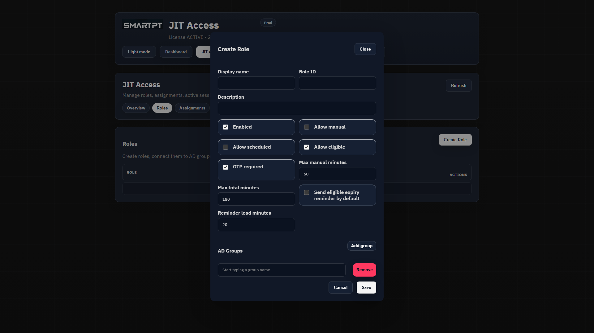

# Create a JIT role

Use this procedure to map temporary access to one or more existing Active Directory groups.

## Before you begin

- The Active Directory group must already exist.
- The SmartPT service identity must be able to add and remove members from the group.
- Decide which assignment types and duration limits the role will allow.
- Test high-impact access with a non-production group first.

## Create the role

1. Open **JIT Access > Roles**.
2. Click **Create Role**.
3. Complete the role fields.
4. Select the existing Active Directory groups for the role.
5. Save the role.

## Role fields

| Field | Description |
| --- | --- |
| **Display name** | Name shown in the JIT portal. |
| **Role ID** | Stable identifier generated from the display name. Keep it unchanged after assignments exist. |
| **Description** | Business purpose of the role. |
| **Enabled** | Makes the role available for assignments. |
| **Allow manual** | Allows administrator-started access. |
| **Allow scheduled** | Allows scheduled access windows. |
| **Allow eligible** | Allows assigned users to activate access. |
| **OTP required** | Requires OTP for eligible activation. |
| **Max manual minutes** | Longest manual access period. |
| **Max total minutes** | Longest active session allowed for the role. |
| **Eligible expiry reminder** | Sends the configured reminder before eligible access expires. |
| **AD Groups** | Existing Active Directory group distinguished names managed by the role. |

## Expected result

The role appears in **Roles** and is available when creating an assignment.

## Verify the role

Confirm the enabled state, access type badges, duration limits, and mapped group count. Create an assignment only after the mapping is reviewed.

## Related pages

- [Create a JIT assignment](./assignments.md)
- [Choose an assignment type](./assignment-types.md)
