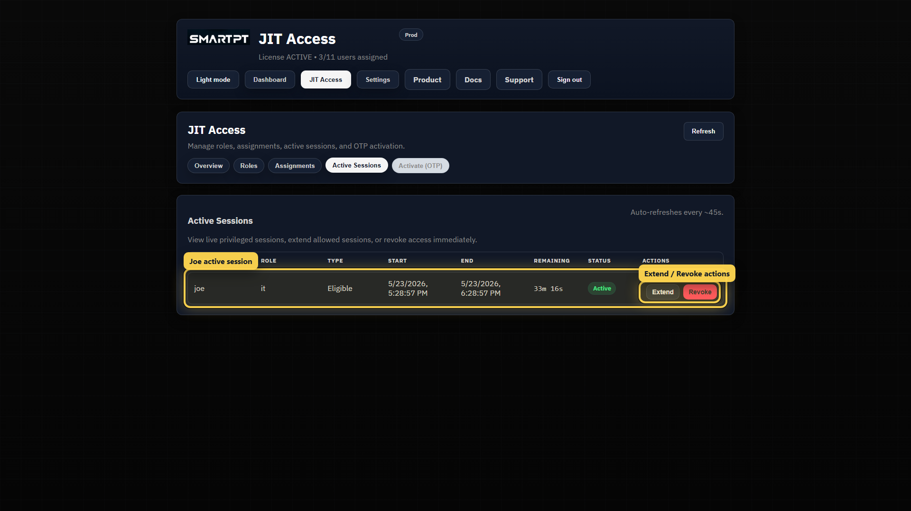
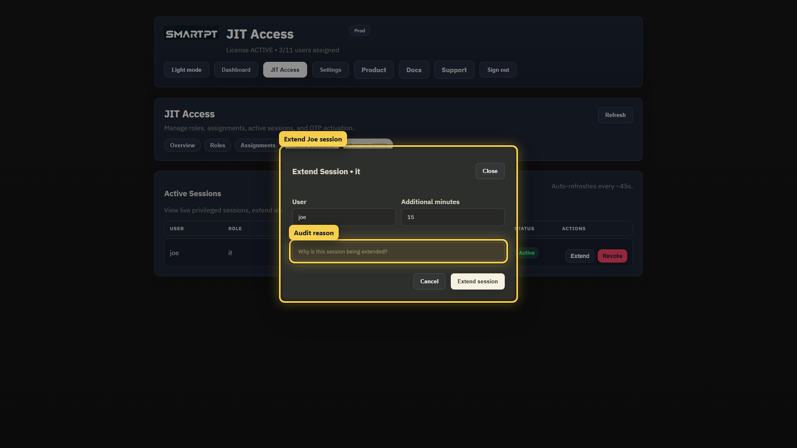

# Monitoring, Sessions, Extend, and Revoke

Active Sessions is the operations view for live privileged access.

Use it when an administrator needs to confirm who is currently elevated, which JIT role is active, when access started, when it expires, and whether the session should be extended or revoked.

## What This Page Solves

Temporary access is only useful when operators can see it while it is active.

The Active Sessions view closes that gap. It shows current privileged sessions and gives JIT administrators immediate action buttons for allowed sessions.

## What Active Sessions Shows

The table shows:

- User account.
- JIT role.
- Assignment type.
- Start time.
- End time.
- Remaining time.
- Current status.
- Available actions.

For eligible and manual sessions, the administrator can extend the session when more time is required. For any active session shown to an authorized administrator, the administrator can revoke access.

## Extend a Session

Use **Extend** only when the business task is still active and the user still needs privileged access.

The extend dialog records:

- The target user.
- Additional minutes.
- Reason for the extension.

The reason is important. It gives the audit trail enough context to explain why the original access window was not enough.

## Revoke a Session

Use **Revoke** when access should stop before the scheduled or configured end time.

Revoking a session ends the active JIT session and removes the user from the AD group mapped by the role.

Do not revoke a production session unless the user has completed the task, the access was opened by mistake, or there is a security reason to stop it immediately.

## Operational Checks

Before extending:

- Confirm the user is still working on the approved task.
- Keep the extension short.
- Enter a clear reason.
- Confirm notification settings if administrators should be notified.

Before revoking:

- Confirm the correct user and role.
- Confirm the business impact.
- Expect access to be removed from the mapped AD group immediately.
- Review the session list again after revoke.

## Notes

Scheduled sessions may be controlled by their schedule window. Manual and Eligible sessions are the primary session types that can be extended from the Active Sessions view.
