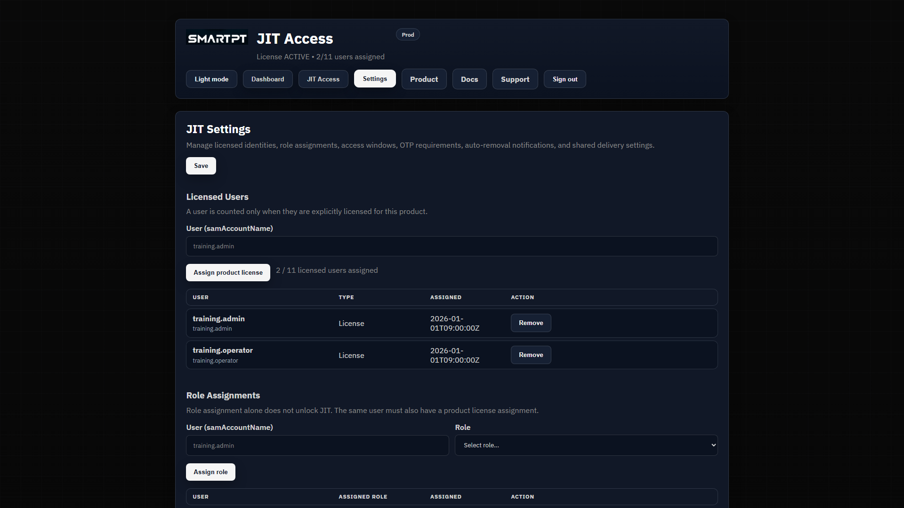

# JIT Access settings

Use **Settings** to manage product licenses, JIT RBAC, product behavior, notifications, SMTP, and portal session limits.

## Settings reference

| Area | Purpose |
| --- | --- |
| **Licensed Users** | Assigns JIT product licenses. A license does not grant JIT administration or Active Directory membership. |
| **Role Assignments** | Assigns JIT product permissions such as **JitAdmin** and **JitEligibleUser**. |
| **Eligible requester groups** | Limits eligible access to configured groups where enabled. |
| **Notification recipients** | Defines recipients for selected JIT session emails. |
| Session event notifications | Controls email for manual activation, eligible activation, extension, and revoke events. |
| **System / Session** | Configures portal session limits, SMTP, and group-specific overrides. |

## Configure settings

1. Confirm the JIT license is active.
2. Assign product licenses.
3. Assign JIT RBAC roles.
4. Review eligible requester groups.
5. Configure notification recipients and event toggles.
6. Configure SMTP when email delivery is used.
7. Review portal session lifetime and idle timeout.
8. Save and test with a non-production role.

## Expected result

Licensed users see only the pages and actions allowed by their JIT RBAC role. Notifications and portal sessions follow the saved product settings.

## Verify settings

- Sign in with a JIT administrator and an eligible user.
- Trigger a non-production session event and confirm the expected notification.
- Confirm session lifetime and idle behavior.
